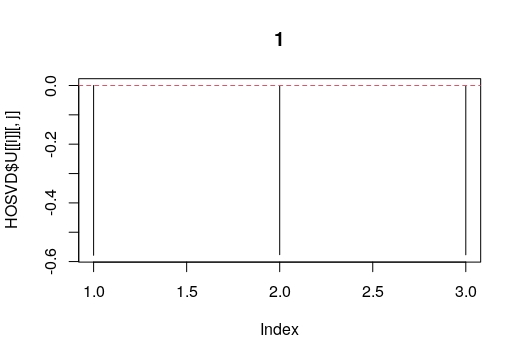
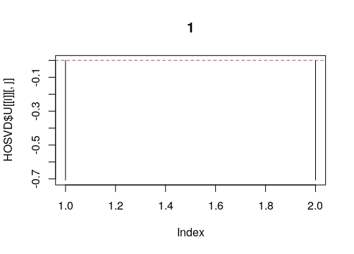
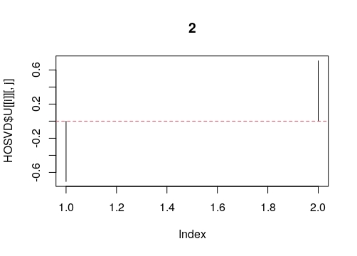
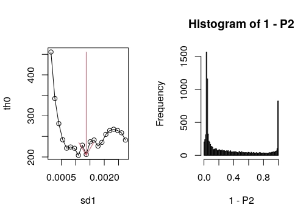
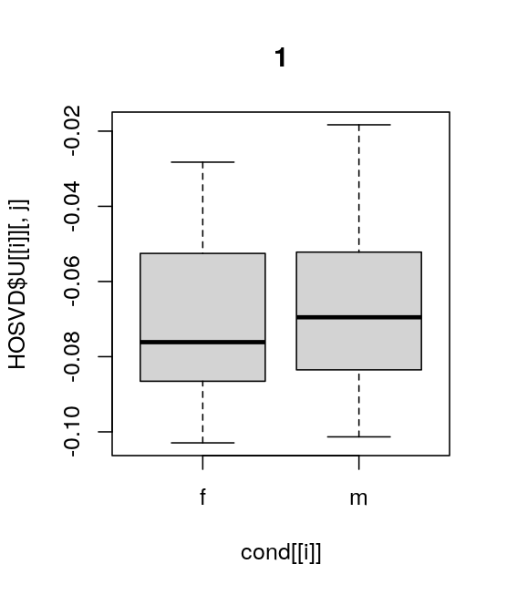
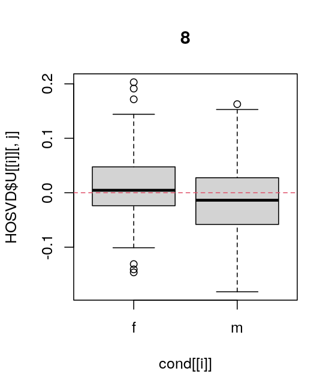
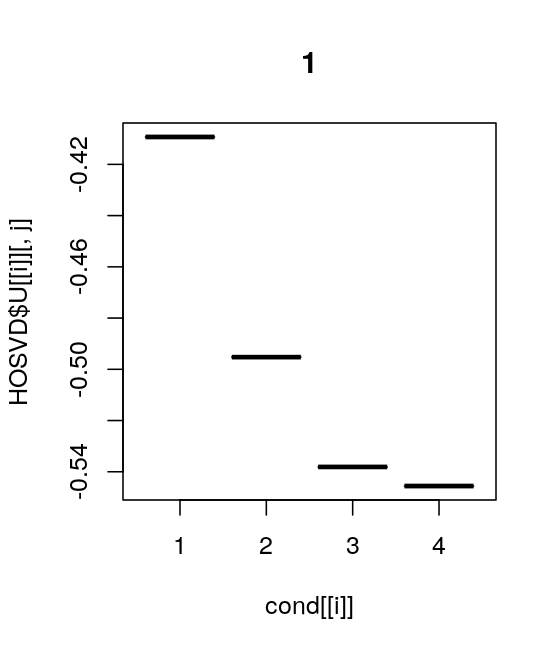
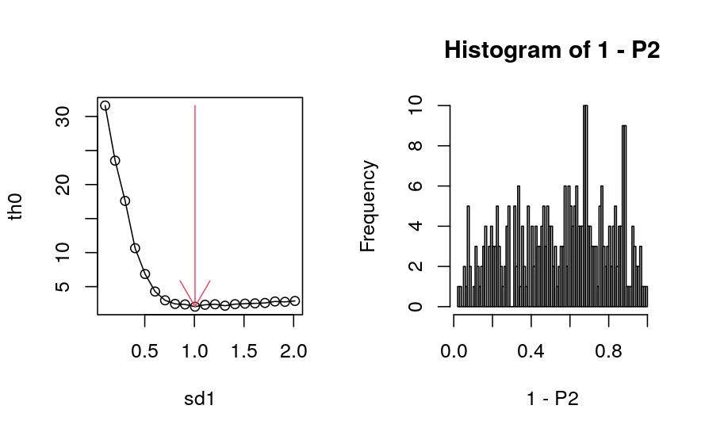
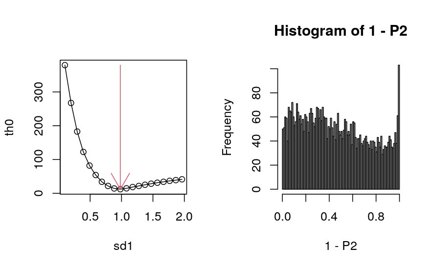
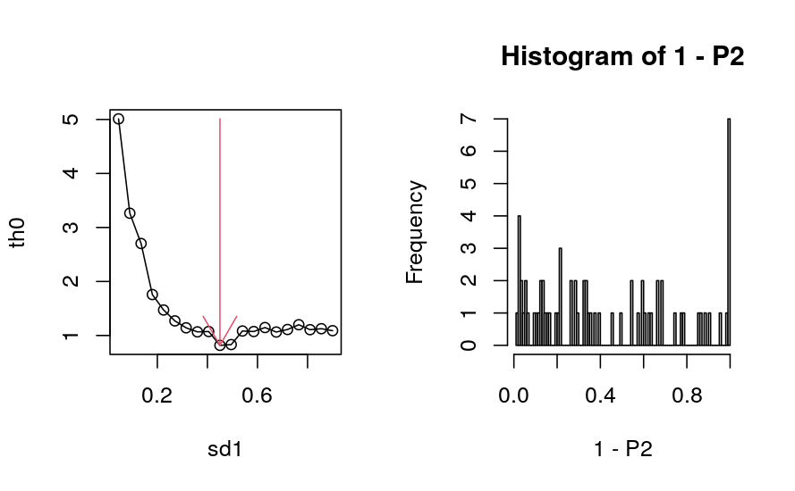

```{r, include = FALSE}
knitr::opts_chunk$set(
  collapse = TRUE,
  comment = "#>"
)
```

# Introduction

```{r setup}
library(TDbasedUFE)
```

Here I introduce how we can use TDbasedUFE to process real data.

## Gene expression.

Here is how we can process real data.
First we prepare the data set from tximportdata oackge
```{r}
require(GenomicRanges)
require(rTensor)
library("readr")
library("tximport")
library("tximportData")
dir <- system.file("extdata", package="tximportData")
samples <- read.table(file.path(dir,"samples.txt"), header=TRUE)
samples$condition <- factor(rep(c("A","B"),each=3))
rownames(samples) <- samples$run
samples[,c("pop","center","run","condition")]
files <- file.path(dir,"salmon", samples$run, "quant.sf.gz")
names(files) <- samples$run
tx2gene <- read_csv(file.path(dir, "tx2gene.gencode.v27.csv"))
txi <- tximport(files, type="salmon", tx2gene=tx2gene)
```

As can be seen on the above, this data set is composed of six samples, which are divided into two classes, each of which includes three out of six samples.
The numer of features is 58288
```{r}
dim(txi$counts)
```
which is too many to excute small desktops, we reduce number of features to 10,000
```{r}
txi[seq_len(3)] <-
    lapply(txi[seq_len(3)],function(x){dim(x);x[seq_len(10000),]})
```

Then we reformat count data, txi\$counts, as a tensor, $Z$, whose dimension is $10000 \times 3 \times 2$ and HOSVD was applied to $Z$ to get tensor decomposition using function computeHosvd.
```{r}
Z <- PrepareSummarizedExperimentTensor(matrix(samples$sample,c(3,2)),
    rownames(txi$abundance),array(txi$counts,c(dim(txi$counts)[1],3,2)))
dim(attr(Z,"value"))
HOSVD <- computeHosvd(Z)
```
Here 3 and 2 stand for the number of samples in each class and the number of classes, respectively. HOSVD includes output from HOSVD.
Next, we need to decide which singular value vectors are used for the download analysis interacxtively. Since vignettes has no ability to store the output from 
interactive outpur from R, you have to input here as

```
input_all <- selectSingularValueVectorSmall(HOSVD)
```
to perform function selectSingularValueVectorSmall in the interactive mode. 
Then you get  the following prompt and graphic.
```
1: NEXT
2: PREV
3: SELCT

Selection: 
```

This display the first singular value vectors attributed to three samples in
individual class. Since we are intersted in gene expression independent of the difference of three samples, we decide to select this one. Then type 3 and press enter to select this one.

Then you get the same prompt and the distinct graphic
```
1: NEXT
2: PREV
3: SELCT

Selection: 
```


This represents the first singular value vector attributed to two classes. 
Since we are not interested in the gene expression which is common between two
classes, we would like to skip this one. Then, type 1 and press enter.
We get the following promt as well as graphic.


```
1: NEXT
2: PREV
3: SELCT

Selection: 
```


This reprsent the second singular value vector attributed to two classes. Since it is what we are interested in, we decide to select. Type 3 and press enter.
Now 1 and 2 is entered in input_all. Since it cannot be down in Rmarkdown, in the 
following, we manually enter 1 and 2 into input_all and execute selectFature 
function (When interactive mode, you do not have to enter 1 and 2 into input_all,
since they were entered into input_all in the above). 

```{r, fig.keep = "none"}
input_all <- c(1,2) #this does not have to be executed in the interactive mode.
index <- selectFeature(HOSVD,input_all)
```

We get the following graphic.
The left one represents the dipendence of "flatness" of histogram of $P$-values 
computed with assuming the null hypothesis.  More or less it can select smallet value.
Thus it is sucessful.
The right one represents the histogram of 1-$P$-values. Peak at right end corresponds to genes selected (The peak at the left end does not have any meaning since they corresponds to $P \simeq 1$). 



Then we try to see top ranked features

```{r}
head(tableFeatures(Z,index))
```

These are associated with $P=0$. Thus, sucessful.

# Multiomics data analysis

Next we try to see how we can make use of TDbasedUFE to perform multiomics analyses.
In order that, we prepare data set using MOFAdata package as follows.
```{r}
require(MOFAdata)
data("CLL_data")
data("CLL_covariates")
help(CLL_data)
```
CLL_data is composed of four omics data, 

 * Drugs: viability values in response to 310 different drugs and concentrations
 * Methylation: methylation M-values for the 4248 most variable CpG sites
 * mRNA: normalized expression values for the 5000 most variable genes
 * Mutations: Mutation status for 69 selected genes

each of which was converted to squared matrix (i. e., liner kernel[@Taguchi2022b])and they are bundle as one tensor using PrepareSummarizedExperimentTensorSquare function, to which HOSVD is applied as follows.
```{r}
Z <- PrepareSummarizedExperimentTensorSquare(
    sample=matrix(colnames(CLL_data$Drugs),1),
    feature=list(Drugs=rownames(CLL_data$Drugs),
    Methylation=rownames(CLL_data$Methylation),
    mRNA=rownames(CLL_data$mRNA),Mutations=rownames(CLL_data$Mutations)),
    value=convertSquare(CLL_data),sampleData=list(CLL_covariates[,1]))
HOSVD <- computeHosvdSqure(Z)
```
CLL_covariate is labeling information, among which we employed the distinction between male (m) and female (f).
```{r}
table(CLL_covariates[,1])
cond <- list(attr(Z,"sampleData")[[1]],attr(Z,"sampleData")[[1]],seq_len(4))
```
Since a tensor is a bundle of liner kernel, the first two singular value vectors are decicated to samples and the third (last) one is dedecated to four omics classes (Drugs, Metylation, mRNA and mutations).
In order to select which singlar value vectors are employed, we execute selectFeatureSqure function in interactive mode as follows
```
input_all <- selectSingularValueVectorLarge(HOSVD,cond)
```
When we get the following prompt and graphics
```
1: NEXT
2: PREV
3: SELCT

Selection: 
```

Since it is not distict between femal and male, we do not select this, thus type 1 and press enter. In actual, the one relatively distinct between male and female is the eight one. Try to show the eighth one with typing 1 to skip other ones.

Then type 3 and press enter to select this one. 



Since rmarkdown does not allow us to perform intarctive mode, we execute it here in a non-interactive mode.

``` {r}
input_all <- selectSingularValueVectorLarge(HOSVD,cond,input_all=c(8,1))
```

Net we need to select singular value vectors attributed to four omics data. Since the first one is most common between four ones, we select this one. Type 3 and press enter.

Now we come to the stage to select features. Since there are four features, we need to optimize SD for each of them. Try to execute selectFeatureSquare in an inyteractive mode as follows.
``` 
index <- selectFeatureSquare(HOSVD,input_all,CLL_data,
    de=c(0.3,0.03,0.1,0.1))
```
In the above, de=c(0.3,0.03,0.1,0.1) represents initial SD for the optimization of SD for each of four omics. There might be need for some trial \& errors to get good initila values.




Every time you type enterin an inteartive mode, you can see one of four plots for four omics data. We can execute this also in non-intearctive mode, if we do not need to see optimized plot in detail.

```{r, fig.keep = "none"}
index <- selectFeatureSquare(HOSVD,input_all,CLL_data,
    de=c(0.3,0.03,0.1,0.1),interact=FALSE) #for batch mode
```

Now the ourput includes four lists each of which corresponds to one of four omics data.
Each list is composed of two vectors whose length is equivalent to the number of fearures in each of omics data. 
Two vectors, index and p.value, stores logical vector that shows if individial features are selected and raw $P$-values.

In order to see selected fearures for all four omics data, tableFeatureSquare function must be repeated four times as
```{r}
for (id in seq_len(4)){print(head(tableFeaturesSquare(Z,index,id)))}
```
# Conclusion

In this vignettes, we briefly introduce how we can make use of TDbasedUFE to perform gen expression analysis and multiomics analysis. I am glad if you can make use of it as well for your own research.


```{r}
sessionInfo()
```
