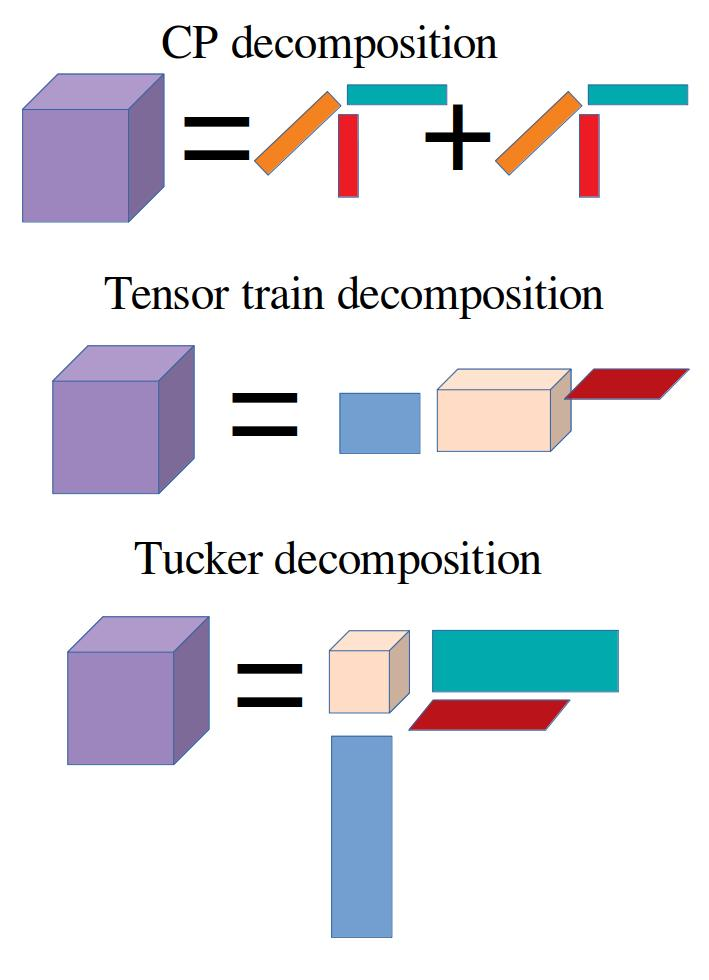
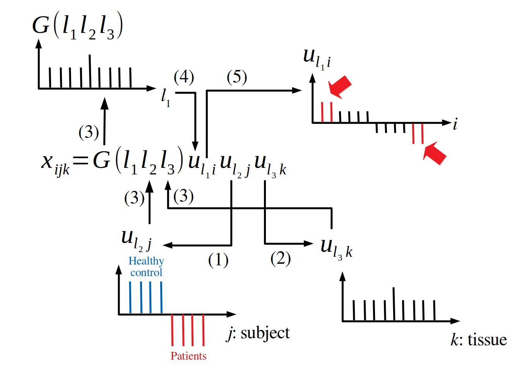
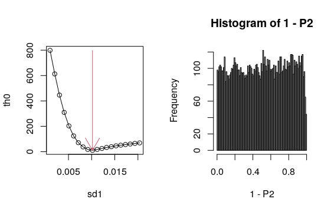

```{r, include = FALSE}
knitr::opts_chunk$set(
  collapse = TRUE,
  comment = "#>"
)
```

```{r setup}
library(TDbasedUFE)
```

# Introduction

TDbasedUFE is a R package that intends to perform various abalyses using
Tensor decomposition based unsupervised feature extraction (TDbasedUFE) 
[@Taguchi2020]
as much as possible in an user friendly manner. 
Although in the future, I am planning to implement all the features possible 
by TDbasedUFE in this R package, at the moment, it includes only basic features.

# What are tensor and tensor decomposition?

Although [tensor](https://bioconductor.org/packages/release/bioc/vignettes/DelayedTensor/inst/doc/DelayedTensor_1.html#12_What_is_Tensor) and [tensor decomposition](https://bioconductor.org/packages/release/bioc/vignettes/DelayedTensor/inst/doc/DelayedTensor_1.html#13_What_is_Tensor_Decomposition) were fully described in vignettes of 
DelayedTensor[@DelayedTensor], we also briefly describe these.

Tensor is a natural extension of matrix that has only rows and columns, whereas
tensore more number of "rows" (or "columns"). For example, three mode tensor,
$x_{ijk} \in \mathbb{R}^{N \times M \times K}$, has three suffix, $i \in \mathbb{N}, j \in \mathbb{N}$, and $k \in \mathbb{N}$, each of which 
ranges $[1, N], [1, K]$ and $[1,M]$. 
This representation fitted with that of genomic datasets, e. g., $x_{ijk}$ can represent gene expression of $i$th gene of $k$th tissue of $j$th subject (person). If the measurements are performed over mutliple conditions, e.g., different time points, we can add additional sufix that corresponds to time. Alternatively, we can also make use of tensor to store multiomics data if we can add additional suffix that represent which of multiomics data is stored in the elements of tensor. 
Since the experimental design has become more and more complicated, tensor is an ideal data structure to store modern genomic observations.

Although tensor can store very complicated structure well, it does not always mean that it has ability to help us to understand these complicated structure. In order to decompose tensor, tensor decomposition was developed. There are various way to compose tensor. Usueally, tensor decomposition (TD) is to decompose tensor into pricuct some of vectors and tensors. 

The most popular TD is CP decomposition, which can decompose tensor into product 
some of vectors. For example, $x_{ijk} \in \mathbb{R}^{N \times M \times K}$ can
be decomposed into the product sum of three vectors, $\mathbb{R}^N,
\mathbb{R}^M$, and $\mathbb{R}^K$. 

{width=50%}

which can be mathematically expressed as
$$
x_{ijk} = \sum_\ell \lambda_\ell u_{\ell i} u_{\ell j} u_{\ell k}
$$
Alternatively, more asvanced way, tensor train decomposition,  can decomposes the tensor to product of a mixuture of matrix and tensor as
$$
x_{ijk} = \sum_{\ell_1} \sum_{\ell_2} R_{\ell_1 i} R_{\ell_1 \ell_2 j} R_{\ell_2 k}
$$
However, in this specific study, we employed more primitive way of decomposition, Tucker decomposition, as
$$
x_{ijk} = \sum_{\ell_1} \sum_{\ell_2} \sum_{\ell_3} G(\ell_1 \ell_2 \ell_3) u_{\ell_1 i} u_{\ell_2 j} u_{\ell_3 k}
$$
where $G \in \mathbb{R}^{N \times M \times K}$ is core tensor that evaluate the weight of  product 
$  u_{\ell_1 i} u_{\ell_2 j} u_{\ell_3 k}$ and $u_{\ell_1 i} \in \mathbb{R}^{N \times N},
u_{\ell_2 j} \in \mathbb{R}^{M \times M}, u_{\ell_3 k} \in \mathbb{R}^{K \times K}$ are singular value matrices and are orthogonal matricies. 

Although there are no uniqueness of Tucker decomposition, we sepfifically employed 
higher order singular value decomposition (HOSVD) [@Taguchi2020] to get Tucker decomposition.
The reason why we employed Tucker decomosition was fully described in my book[@Taguchi2020].

 

## Tensor decomposition based unsupervised feature extraction.

{width=50%}

Here we briefly describe how we can make use of HOSVD for the feature selection.
Suppose $x_{ijk}$ represents the expression of gene $i$ of the $k$th tissue of the $j$th subject (person) and the task is to select genes whose expression is distict between patients and healthy controls only at one specific tissue.
In order that, we need to select  $u_{\ell_2 j}$ attributed to $j$th subject which is distinct between healthy control and patients (see (1)) and  $u_{\ell_3 k}$ attributed to $k$th tissue is $k$th tissue specific (see (2)). Then we next identify which $G(\ell_1 \ell_2 \ell_3)$ has the largest absolute value with fixed $\ell_2$ and $\ell_3$ that correspond to ditinction between patient and healthy control and tissue specificity, respectvely (see (3)). Finally, with assuming that $u_{\ell_1 i}$ obeys Gaussian distribution (null hypothesis), $P$-values are attributed to $i$th gene.
$P$-values are corrected with considering multiple comparison corrections (specifically, we employed Benjamini Hochberg method[@Taguchi2020]) and genes associated with adjusted P-values less than 0.01 are usually selected (see (4) and (5)).

## Optimization of standard deviation

Although TD based unsupervised FE was proposed five years ago, it was successfully applied to wide range of genomic science, together with the proto type method, principal component analysis (PCA) based unsupervised FE proposed ten years ago, we recently recognize that the oprimization of the standard deviation (SD) in Gaussian  distribution employed as the null hypothesis drastically improved the performance[@Taguchi2022a] [@Taguchi2022] [@Roy2022].
How we can optimize SD and why the optimization of SD can improve the perfoemance is as follows. Previously, we computed SD of $u_{\ell_1 i}$, $\sigma_{\ell_1}$ as
$$
\sigma_{\ell_1} = \sqrt{\frac{1}{N} \sum_i \left ( u_{\ell_1 i} - \langle u_{\ell_1i} \rangle\right)^2}
$$
$$
\langle u_{\ell_1 i} \rangle = \frac{1}{N} \sum_i u_{\ell_1 i}.
$$
However, $\sigma_{\ell_1}$ has tendency to be over estimated since some of $i$th does not follow Gaussian distrbution and has too large absolute values.
In order to exclude those $i$ that does not follow Gaussian, we tried to minimize SD of $h_n$ which is the frequency of $P_i$ computed with assuming that $u_{\ell_1 i}$ obeys Gaussian and falling into $n$th bin of histogram $P_i$
$$
\sigma_h = \sqrt{ \frac{1}{N_h} \sum_n \left ( h_n - \langle h_n \rangle \right)^2}
$$
where $N_h$ is the number of bins of the histogram of $P_i$ and 
$$
\langle h_n \rangle = \frac{1}{N_h} \sum_n h_n
$$
with excluding some of $P_i$ which is supposed to be too small to assume that obeys Gaussian (Null hypothesis).  This is because $h_n$ should be constant if all of $P_i$ follows Gaussian (Null hypothesis).  


{width=50%}

The above plot is output of examples of function selectFeature in TDbasedUFE package and represents the dependence of $\sigma_h$ upon $\sigma_{\ell_1}$ as well as the resulting histogram $h_n$ of $1-P_i$ when $u_{\ell_1 i}$ is fully generated from Gaussian. The smallest $\sigma_h$ correctly corresonds to the true $\sigma_{\ell_1} (=0.01)$ and $h_n$ is almost independent of $n$ as expected. 

Thus it is expected that $\sigma_h$ will take the smallest value when we correctly exclude $i$s whose $P_i$ does not obey Gaussian (Null hypothesis).
The following is the step to optimized $\sigma_{\ell_1}$.

1. Prepare initial $\sigma_{\ell_1}$ and define threshold adjusted $P$-value, $P_0$.

1. Attribute $P_i$s to $i$s with assuming Gaussian distribution of $u_{\ell_1 i}$ using $\sigma_{\ell_1}$.

1. Attribute adjusted $P_i$s to $i$s with using Benjamini-Hochberg criterion.

1. Exclude $i$s associated with adjusted $P_i$ less than $P_0$.

1. Compute histogram of $1-P_i$ and $\sigma_h$.

1. Modify $\sigma_{\ell_1}$ until $\sigma_h$ is minimized.

1. Finally, we identify excluded $i$s  as the selected features because these $i$s do not obey Gaussian (Null hypothesis)  


# Conclusions

In this vignettes, we explain how TD based unsupervised FE can work with optimized SD. In the other vignettes, we introduce how it works well in the real examples.

```{r}
sessionInfo()
```

